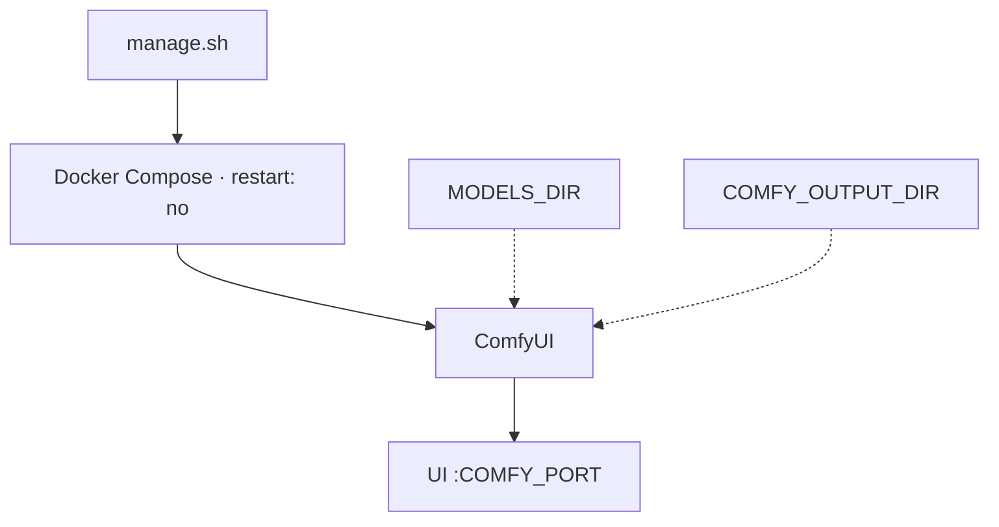
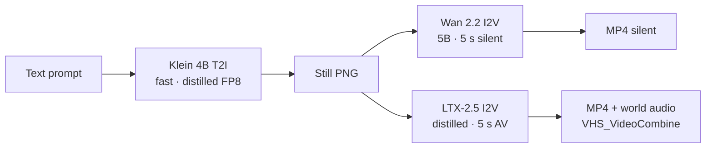

# Still to motion to AV

**What's on this page**

- Combined Klein → Wan → LTX pipeline
- Iteration loop (change widgets, not JSON)
- Watching VHS MP4 output
- Pointers to the workflow catalog and hardware notes

**What this enables**

- Running still + silent motion + AV tools in **one** Docker Compose stack
- Iterating in minutes on ~5 s clips instead of a 90 s denoise

**Who this is for:** studio users after `klein-still-draft-lab-example` has queued once.

!!! tip "First run?"

    For install and first UI open, use [Getting Started](getting-started.md). For canvas nouns, [ComfyUI basics](learn/comfyui.md). For why these three models, [Klein, Wan, and LTX](learn/pipeline.md). Filenames: [Workflow catalog](studio-workflows.md).

---

## Architecture (one screen)

| Setting | Value |
| --- | --- |
| Profile | `us-safe-studio` |
| Memory limit / reservation | 90g / 80g |
| GPU | all (1× GB10) |
| restart | `"no"` |
| Image | Klein 4B distilled FP8 (`LAB_IMAGE_TIER=fast`) |
| Wan | 2.2 TI2V-5B (`LAB_WAN_TIER=5b`), silent |
| LTX | 2.5 distilled INT8-convrot (`LAB_LTX_TIER=2.5`) |
| Nunchaku | **off** (`LAB_VISUAL_ENABLE_NUNCHAKU=0`) |

MiniMax H3 is **not** in this stack (US Excluded Territory). See [Model licenses](licenses.md). Unified memory, Kitchen attention, and the entrypoint sequence: [Hardware, memory, and safety](learn/hardware.md).



---

## Combined pipeline (Klein → Wan → LTX)

Text → still → **silent 5 s** → **AV 5 s** in one ComfyUI stack.



**Handoff (start in App Mode):** load **klein-still-draft-lab-example** → enter App Mode → Queue Spark Still → open **klein-still-hero-lab-example** (same seed) → set **wan-i2v-5s-lab-example** LoadImage to `ez_still_draft_*.png` or `ez_still_hero_*.png` → Queue ~5 s silent → optional **ltx-i2v-5s-lab-example** for native audio. Stop Wan before LTX (occupancy). I2V graphs also Queue on Comfy’s default **example.png**. Apps catalog: [ComfyUI Apps](studio-apps.md).

LTX-2.5 is a **joint audio/video** transformer. Seeded LTX graphs load the **audio VAE**, create matching empty audio latents, concat them with video latents before `KSampler`, then decode audio with **`LTXVAudioVAEDecode`** into **`VHS_VideoCombine`** so the MP4 includes world audio. Text conditioning is a single **CLIPLoader** (`gemma4-12b-with-proj-ltx-2.5-comfy-int8-convrot`, type **`ltxv`**).

!!! example "Pipeline tips"

    1. Download the default pack first (`download-models` = image fast + wan 5b + ltx 2.5)
    2. Prefer keeping both model sets loaded between T2I and I2V
    3. Do not GPU-offload a 30B+ llama.cpp next to LTX; Prompt Enhance is CPU-only (~2.5 GiB GGUF)
    4. Video graphs emit **MP4** via **VideoHelperSuite** (`VHS_VideoCombine`, 24 fps) plus optional PNG frames
    5. Prompting: Klein wants Qwen-style prose (subject → light → camera); Wan wants motion + one camera move (no audio); LTX wants a present-tense paragraph with sound interleaved. See [Prompting](prompting.md). Every **\*-lab-example** canvas has an operator **Note**

Which filename: [Workflow catalog](studio-workflows.md).

---

## Iteration loop (YouTube 16:9)

Do **not** edit raw JSON. Change widgets on the canvas.

1. Load **klein-still-draft-lab-example** → set Positive prompt + seed (fixed) → Queue (minutes, 4-step).
2. Pick a frame under `${COMFY_OUTPUT_DIR}` (`ez_still_draft_*.png`).
3. Load **wan-i2v-5s-lab-example** → set LoadImage to that PNG (or leave `example.png` to smoke-test) → edit **Motion / prompt** only → Queue ~5 s silent.
4. Optional audio: **ltx-i2v-5s-lab-example**, same first frame, same seed note, Queue ~5 s AV at **1280×704**.
5. Short six-shot demo: Queue **wan-i2v-shot-lab-example** six times (`ez_shot_01` … `06`) then:

    ```bash
    ./scripts/utilities/concat-shots.sh --yes
    # default dir is ${COMFY_OUTPUT_DIR}; writes ez_concat_shots.mp4
    ```

6. **90s films** (go-see first-person parkour / still-here / switchyard): load one **film-*-90s** graph → Queue **once** → the MP4 is already at `${COMFY_OUTPUT_DIR}/ez_<slug>_90s.mp4`; open **Save 90s film (MP4)** to preview or download. See [90s shorts](shorts.md).
7. Daily still / GIF / IG pack: **klein-still-daily-lab-example** → optional **wan-gif-loop-lab-example** (LoadImage = `ez_still_app_*.png`, leave ping-pong on) or **klein-dream-house-lab-example** for a 10-photo carousel of one cabin (new cameras, locked inventory).
8. Creator toolkit: vertical Shorts still→I2V, thumbnail, packshot, before/after, style lock, bumper, B-roll, storyboard 6-up — [catalog](studio-workflows.md).

Do not Queue a 90s denoise. Default graphs iterate in minutes; one-click films are 18 × 5s prints.

---

## Watch the video (Wan / LTX)

!!! tip "Primary output is MP4"

    Seeded **wan-*** and **ltx-*** graphs install **ComfyUI-VideoHelperSuite** and wire **`VHS_VideoCombine`** after video `VAEDecode` (`save_output: true`). LTX graphs also run **`LTXVAudioVAEDecode`** into the VHS **audio** input so world audio is muxed into the MP4. After **Queue**, open **Save video (MP4) — open node for preview** for an **inline preview**. PNG **Save frames (secondary)** is optional. Files are on the **host** at `${COMFY_OUTPUT_DIR}` (container `/outputs`). `cleanup` does **not** delete this folder.

```bash
ls "${COMFY_OUTPUT_DIR}"/ez_still_draft_*.png
ls "${COMFY_OUTPUT_DIR}"/ez_ltx_*_video_*.mp4
```

| Graph | Frames | FPS | ≈ duration |
| --- | --- | --- | --- |
| `wan-i2v-5s` / `wan-t2v-5s` / `ltx-*-5s` | 121 | 24 | ~5.04 s |
| `wan-i2v-shot` / `ltx-i2v-shot` | 120 | 24 | **5.00 s** |
| 90s film (18 LTX prints + concat) | — | 24 | **90.00 s** cap |

!!! warning "Do not Queue a 30 s / 60 s / 90 s latent"

    Long latents melt Spark. Film graphs still use **120-frame** printers (18 × 5.00 s) and stitch. Keep headroom preflight green. A one-click film Queue is **long wall-clock**, not a 90s denoise.

If **`VHS_VideoCombine` is missing**, pull/rebuild the image and restart so install refresh can clone VideoHelperSuite — see [Troubleshooting](troubleshooting.md).

??? abstract "Lab workflow internals"

    - Name pattern: host files `workflows/*-lab-example.json` and `workflows/shorts/*-lab-example.json` (entrypoint copies both)
    - Every graph has a ComfyUI **Note** node + `extra.lab_note` with the same operator guidance
    - Klein CLIP loader type is **`flux2`** with `qwen_3_4b` + `EmptyFlux2LatentImage` (simplified `KSampler`)
    - LTX-2.5 graphs use **CLIPLoader** (`gemma4-12b-with-proj-ltx-2.5-comfy-int8-convrot`, type **`ltxv`**), save **MP4** via **`VHS_VideoCombine`** (h264, 24 fps)
    - LTX is **joint AV**: empty audio latents concat with video before `KSampler`, then **`LTXVAudioVAEDecode` → `VHS_VideoCombine.audio`**
    - Lab Klein graphs use **core** loaders only (not ComfyUI-nunchaku)

??? abstract "Optional LTX-2.3 fallback"

    If LTX-2.5 access or INT8-convrot fails: `./scripts/utilities/download-ltx.sh run --tier 2.3` pulls Kijai distilled FP8 + Gemma 3 DualCLIP. **Seeded lab graphs still expect LTX-2.5 filenames** — do not treat 2.3 as the default playbook.

---

## Commands

First-run commands live on [Getting Started](getting-started.md). Day-to-day: [manage.sh reference](manage-cli.md).

```bash
./scripts/manage.sh doctor
./scripts/manage.sh status
./scripts/manage.sh logs
./scripts/manage.sh spark-timing show
./scripts/manage.sh stop
```

---

## Safety

!!! warning "Do not weaken"

    - Manual start only (`restart: "no"`)
    - Headroom preflight before start
    - Exclusive use of the GPU for this demo stack
    - Always `stop` before reboot — [Reboot safety](reboot-safety.md)
